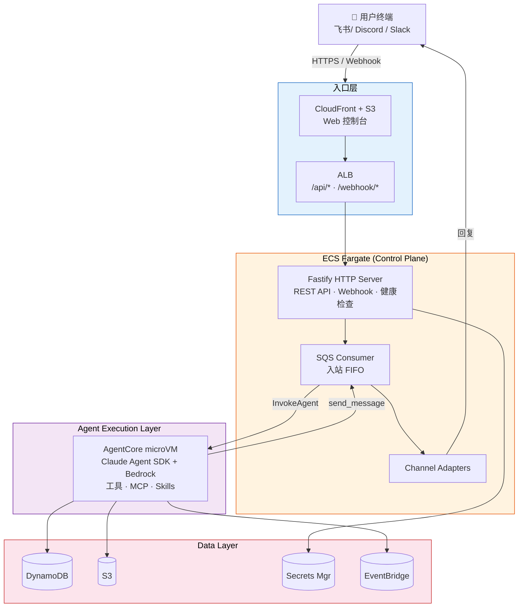

<div align="center">

<!-- Logo / Title -->
<h1>
  
</h1>

<p><strong>Multi-tenant NanoClaw on AWS</strong></p>

<p>
  <em>Create Bots · Connect Channels · Run Claude Agents in Isolated Cloud Environments</em>
</p>

<!-- Badges -->
<p>
  
  
  
  
  
</p>

<!-- Quick Links -->
<table>
  <tr>
    <td align="center"><a href="./docs/nanoclaw-architecture.pptx"><strong>📊 Architecture PPT</strong></a><br/><sub>System overview slides</sub></td>
    <td align="center"><a href="./docs/CLOUD_ARCHITECTURE.md"><strong>📐 Architecture Doc</strong></a><br/><sub>Full design details</sub></td>
    <td align="center"><a href="#deployment"><strong>🚀 Deploy Guide</strong></a><br/><sub>One-command deploy</sub></td>
    <td align="center"><a href="#local-development"><strong>💻 Local Dev</strong></a><br/><sub>Dev setup</sub></td>
  </tr>
  <tr>
    <td align="center"><a href="#message-flow"><strong>📨 Message Flow</strong></a><br/><sub>End-to-end walkthrough</sub></td>
    <td align="center"><a href="#security"><strong>🔒 Security</strong></a><br/><sub>Auth & isolation</sub></td>
    <td align="center"><a href="#packages"><strong>📦 Packages</strong></a><br/><sub>Monorepo structure</sub></td>
    <td align="center"><a href="./docs/TODO.md"><strong>📋 TODO</strong></a><br/><sub>Roadmap & backlog</sub></td>
  </tr>
</table>

<br/>

<details>
<summary><strong>📚 Architecture Deep-Dive Docs</strong></summary>
<br/>

| Doc | Topic |
|-----|-------|
| [04 — Layered Architecture](./docs/architecture/04-layered-architecture.md) | Service layers, channels, providers |
| [05 — Data Model](./docs/architecture/05-data-model.md) | DynamoDB tables, S3 layout |
| [06–07 — Lifecycles](./docs/architecture/06-07-lifecycles.md) | Bot & session lifecycle |
| [08 — Channel Management](./docs/architecture/08-channel-management.md) | Telegram, Discord, Slack, Feishu |
| [09–10 — Agent Runtime](./docs/architecture/09-10-agent-runtime.md) | AgentCore, Claude SDK, MCP tools |
| [11–12 — Security & Observability](./docs/architecture/11-12-security-observability.md) | ABAC, WAF, CloudWatch |
| [15 — CDK Deployment](./docs/architecture/15-cdk-deployment.md) | 6-stack CDK infrastructure |
| [16 — System Prompt Builder](./docs/architecture/16-system-prompt-builder.md) | Agent context construction |

</details>

</div>

<br/>

> Evolved from [NanoClaw](../README.md) — a single-user local bot framework — into a fully managed, multi-tenant cloud platform. Each user gets their own Bots with independent memory, conversations, and scheduled tasks.

---

## Architecture

```
User (Telegram/Discord/Slack)
  │
  ▼ Webhook
ALB ──► ECS Fargate (Control Plane)
         ├── Webhook Handler → SQS FIFO
         ├── SQS Consumer → AgentCore Runtime (microVM)
         │                    └── Claude Agent SDK
         │                        └── Bedrock Claude
         ├── Reply Consumer → Channel API → User
         └── REST API (JWT auth) ◄── Web Console (React SPA on CloudFront)

Data Layer: DynamoDB (state) │ S3 (sessions, memory) │ Secrets Manager (credentials)
Scheduling: EventBridge Scheduler → SQS → Agent
Auth: Cognito User Pool (JWT)
Security: WAF │ ABAC via STS SessionTags │ Per-tenant S3/DynamoDB isolation
```



## Packages

| Package | Description |
|---------|-------------|
| `shared/` | TypeScript types and utilities (ported from NanoClaw) |
| `infra/` | AWS CDK — 6 stacks (Foundation, Auth, Agent, ControlPlane, Frontend, Monitoring) |
| `control-plane/` | Fastify HTTP server + SQS consumers (runs on ECS Fargate) |
| `agent-runtime/` | Claude Agent SDK wrapper (runs in AgentCore microVMs) |
| `web-console/` | React SPA — bot management, channel config, message history, tasks |

## Key Decisions

| Decision | Choice | Why |
|----------|--------|-----|
| Tenant model | One user, many Bots | Per-scenario isolation |
| Channel credentials | BYOK (Bring Your Own Key) | User controls their bots |
| Control plane | ECS Fargate (always-on) | No 15-min Lambda timeout |
| Agent runtime | AgentCore (microVM) | Serverless, per-session isolation |
| Agent SDK | Claude Agent SDK + Bedrock | Full tool access, IAM-native auth |
| Message queue | SQS FIFO | Per-group ordering, cross-group parallelism |
| Database | DynamoDB | Serverless, millisecond latency |
| Auth | Cognito | Managed JWT, self-service signup |
| IaC | CDK (TypeScript) | Type-safe, same language as app |

## NanoClaw → Cloud Mapping

| NanoClaw (single-user) | ClawBot Cloud (multi-tenant) |
|------------------------|------------------------------|
| SQLite | DynamoDB (7 tables) |
| Local filesystem (`groups/`) | S3 (sessions, CLAUDE.md memory) |
| Docker containers | AgentCore microVMs |
| File-based IPC | MCP tools → AWS SDK (SQS, DynamoDB, EventBridge) |
| Polling loop | SQS FIFO consumer |
| Channel self-registration | Webhook HTTP endpoints |
| Credential proxy | IAM Roles + STS ABAC |

## Prerequisites

- Node.js >= 20
- Docker (for building ARM64 container images)
- AWS CLI configured (`aws configure`)
- AWS CDK bootstrapped (`cd infra && npx cdk bootstrap`)
- `jq` installed (used by deploy script for JSON parsing)

## Deployment

### One-Command Deploy

```bash
# Full deployment (default stage: dev)
./scripts/deploy.sh

# Deploy to a specific stage
CDK_STAGE=prod AWS_REGION=us-east-1 ./scripts/deploy.sh
```

The deploy script runs 15 steps in order:
1. Pre-flight checks (aws, docker, node, jq)
2. `npm install` + build all workspaces
3. ECR login (creates repos if missing)
4. Build & push control-plane Docker image (ARM64)
5. Build & push agent-runtime Docker image (ARM64)
6. CDK deploy all 6 stacks
7. Read stack outputs (Cognito IDs, bucket names, role ARNs, ALB DNS, CDN domain)
8. Register AgentCore runtime (idempotent — skips if already exists)
9. Wait for AgentCore status READY
10. Update ECS task definition with `AGENTCORE_RUNTIME_ARN` env var
11. Force new ECS deployment
12. Build web-console with Cognito config injected via env vars
13. Sync `web-console/dist/` to S3 frontend bucket
14. CloudFront cache invalidation
15. Smoke test (`/health` endpoint)

### Teardown

```bash
./scripts/destroy.sh                    # default stage: dev
CDK_STAGE=prod ./scripts/destroy.sh     # specific stage
```

Reverse order: delete AgentCore runtime (wait for deletion) → CDK destroy all stacks → delete ECR repos.

### Local Development

```bash
# Run control plane locally (pointing at deployed AWS resources)
cd control-plane
cp .env.example .env   # fill in values from CDK outputs
npm run dev

# Run web console locally
cd web-console
npm run dev            # opens http://localhost:5173
```

## Project Structure

```
cloud_native_nanoclaw/
├── scripts/
│   ├── deploy.sh             # One-command full deployment (15 steps)
│   └── destroy.sh            # Reverse teardown
├── shared/src/
│   ├── types.ts              # User, Bot, Channel, Message, Task, Session...
│   ├── xml-formatter.ts      # Agent context formatting (from NanoClaw)
│   └── text-utils.ts         # Output processing
├── infra/
│   ├── bin/app.ts            # CDK app entry
│   └── lib/
│       ├── foundation-stack.ts   # VPC, S3, DynamoDB, SQS, ECR
│       ├── auth-stack.ts         # Cognito
│       ├── agent-stack.ts        # IAM Roles (ABAC)
│       ├── control-plane-stack.ts# ALB, ECS Fargate, WAF
│       ├── frontend-stack.ts     # CloudFront + S3
│       └── monitoring-stack.ts   # CloudWatch, alarms
├── control-plane/src/
│   ├── index.ts              # Fastify app + SQS consumer startup
│   ├── webhooks/             # Telegram, Discord, Slack handlers
│   ├── sqs/                  # Message dispatcher + reply consumer
│   ├── routes/api/           # REST API (bots, channels, groups, tasks)
│   ├── services/             # DynamoDB, cache, credential lookups
│   └── channels/             # Channel API clients
├── agent-runtime/src/
│   ├── server.ts             # HTTP server (/invocations, /ping)
│   ├── agent.ts              # Claude Agent SDK integration
│   ├── session.ts            # S3 session sync
│   ├── memory.ts             # Multi-layer CLAUDE.md
│   ├── scoped-credentials.ts # STS ABAC
│   ├── mcp-tools.ts          # send_message, schedule_task, etc.
│   └── mcp-server.ts         # MCP stdio server
└── web-console/src/
    ├── pages/                # Login, Dashboard, BotDetail, ChannelSetup...
    ├── lib/                  # Auth (Cognito), API client
    └── components/           # Layout
```

## Message Flow

1. User sends `@Bot hello` in Telegram group
2. Telegram POST → `/webhook/telegram/{bot_id}` (ALB → Fargate)
3. Webhook handler verifies signature, stores message in DynamoDB, enqueues to SQS FIFO
4. SQS consumer dequeues, loads recent messages, formats XML context
5. Invokes AgentCore Runtime → Claude Agent SDK `query()`
6. Agent generates response, optionally uses MCP tools (schedule_task, send_message)
7. Response stored in DynamoDB, sent back via Telegram API
8. User sees reply in Telegram

## Security

- **Auth**: Cognito JWT on all `/api/*` routes
- **Webhooks**: Per-channel signature verification (Telegram secret token, Discord Ed25519, Slack HMAC-SHA256)
- **Data isolation**: ABAC via STS SessionTags — agents can only access their owner's S3 paths and DynamoDB records
- **Network**: Fargate in private subnets, WAF rate limiting (2000 req/5min/IP)
- **Credentials**: Channel tokens stored in Secrets Manager, never exposed to agents

## Cost Estimate (single user)

| Component | ~Monthly Cost |
|-----------|--------------|
| AgentCore (30 msgs/day, 18s avg) | $0.40 |
| Bedrock Claude tokens | $5.40 |
| Fargate (2 tasks, 0.5 vCPU) | $30 |
| ALB | $16 |
| DynamoDB (on-demand) | $0.50 |
| S3 + CloudFront | $0.60 |
| **Total (1 user)** | **~$53/mo** |
| **100 users (amortized)** | **~$8/user/mo** |

## Documentation

| Resource | Description |
|----------|-------------|
| [📊 Architecture PPT](./docs/nanoclaw-architecture.pptx) | Visual system overview slides |
| [📐 Cloud Architecture](./docs/CLOUD_ARCHITECTURE.md) | Full design document with all details |
| [📋 TODO & Roadmap](./docs/TODO.md) | Backlog, deferred items, future work |